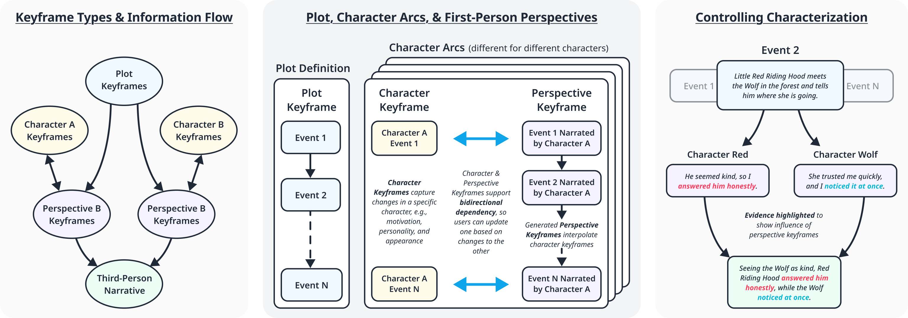

# Narrative Keyframing

[**Read the UIST 2026 paper**](https://arxiv.org/abs/2608.10337)

We introduce narrative keyframing, an interaction technique for AI-assisted creative writing that lets writers specify different types of narrative constraints at selected moments in a story, then use AI to generate intervening prose. Inspired by the use of keyframing in animation, narrative keyframing offers a flexible way to connect story planning with adaptive control over generated text. We explore three types of keyframes: plot keyframes define significant events in a story, character keyframes represent how individual characters change over the narrative, and perspective keyframes capture how individual characters experience different events through first-person narratives. Plot and character keyframes offer a flexible way to adapt the type of high-level conditioning explored in previous AI writing tools to more customizable, iterative, and fine-scale control, while perspective keyframes add a new way to control characterization and focalization by using first-person narratives as an intermediary. Through a user study, we show that narrative keyframing supports a more controllable, transparent, and engaging way to use generative AI in creative writing.



## Requirements

- Node.js 20+
- An [OpenAI API key](https://platform.openai.com/api-keys)

No `.env` file is needed — the app asks for your OpenAI API key on first load and stores it only in your browser, sending it directly with each request.

## Run locally

```bash
npm install
npm run dev
```

Then open <http://localhost:3000>, click **Open tool**, and enter your OpenAI API key when prompted.

## Build for production

```bash
npm run build
npm start
```

## UIST 2026 Paper

**Narrative Keyframing for Generative Creative Writing**  
Chao Zhang, Abe Davis  
Cornell University

## Citation

If you use the code in this repository, please cite the paper:

> Chao Zhang and Abe Davis. 2026. *Narrative Keyframing for Generative Creative Writing.* In *The 39th Annual ACM Symposium on User Interface Software and Technology (UIST ’26)*, November 02–05, 2026, Detroit, MI, USA. ACM, New York, NY, USA.

```bibtex
@article{zhang2026narrative,
  title   = {Narrative Keyframing for Generative Creative Writing},
  author  = {Zhang, Chao and Davis, Abe},
  journal = {arXiv preprint arXiv:2608.10337},
  year    = {2026},
  doi     = {10.48550/arXiv.2608.10337}
}
```
